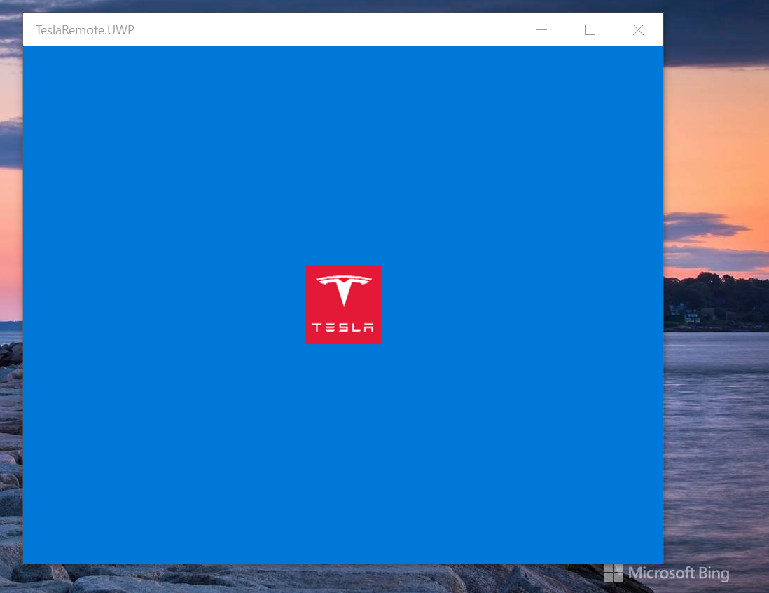

# TeslaRemoteX

My XF fork of some TeslaRemote project.

This is the part of Project Gemini.

## Screenshots

## Plan of RnD
- Research
- Design
- Tech
- Dev
- Intro

## Platforms
- Win10/11 (Windows Tablet, min os build 16299)
- Android 
- iOS

## Get your Tesla crendentials

You can use the following apps to generate an Access Token & Refresh Token from the Tesla server :: 
- iOS: https://apps.apple.com/us/app/auth-app-for-tesla/id1552058613#?platform=iphone
- Android: https://play.google.com/store/apps/details?id=net.leveugle.teslatokens

## .
AS IS. No support. RnD only.

## ..
-- [m][e] 2022
 
